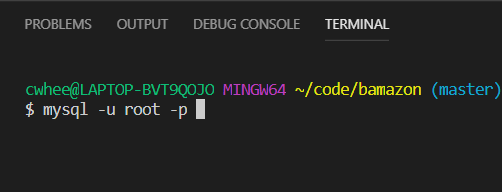
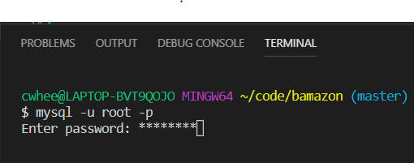
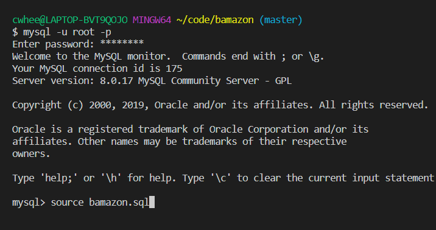
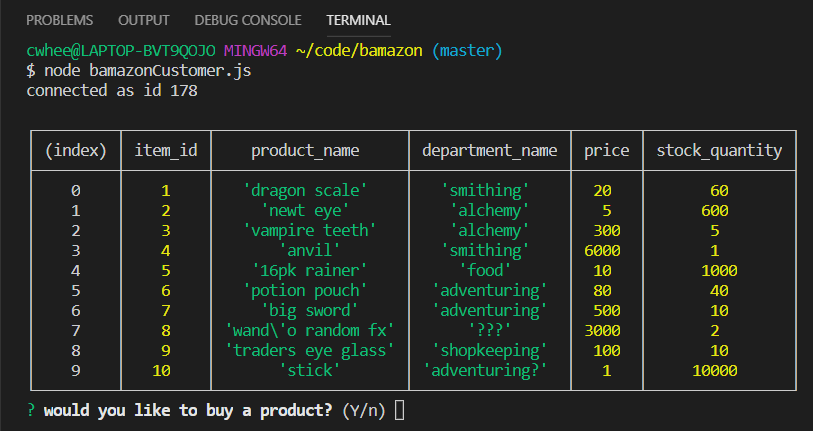
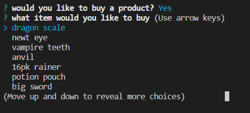
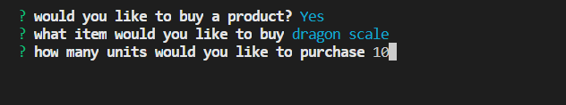

## Application Summary:

This application uses a inqiurer to create an Amazon like experience where in which

## Application Install Requirements:

To get this application running properly on your machine a few steps must be taken.

### Step one: Download packages

In order to run the app you'll have to write "npm i" inside of your terminal window at the customer.js file path to gain access to the required packages: mysql and inquirer. As well you must have mysql aplication installed on your computer in order to generate a table.

### Step Two: Loading MYSQL

Rad! Now that you have installed the packages you can move on to creating a table to grab information from within the customer.js file.

* Within the termial run the command "mysql -u root - p".

* You will be prompted asking for a password, type in in "password"

* Run the command "source bamazon.sql" to create a table filled with the store information.

* To exit mysql simply type "quit"

##### Nice you're ready to use the app!

#App: How to use

To start the program simply type in the command 'node bamazonCustomer.js". This will show a table of the items for sale.

* Your first inquirer prompt will ask you whether or not you'd like to purchase somthing.

* Upon typing yes and pressing enter, you'll be asked which item you'd like to purchase.

*Lastly you'll be asked how many items you would like to purchase, if your number exceeds the stock quanitiy you won't be able to purchase it and have to start over.

 
## Thanks for using my app!